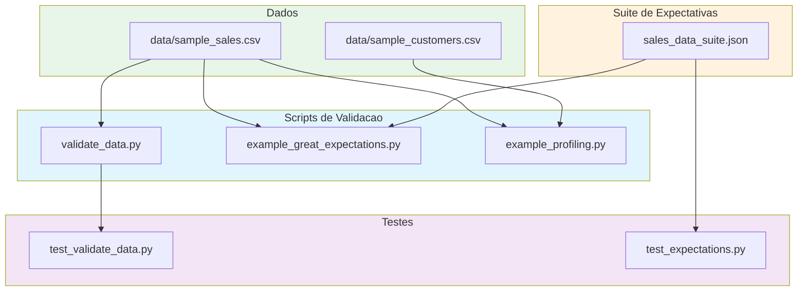
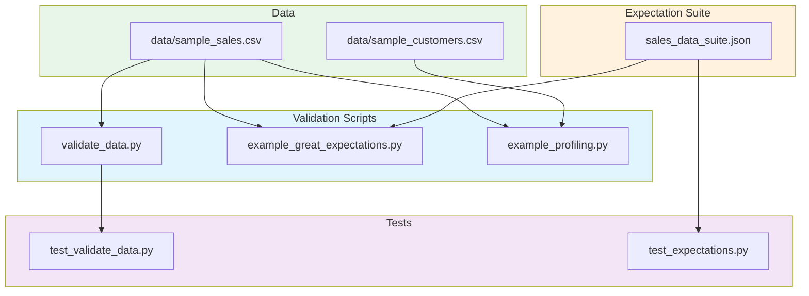

# Data Quality Framework (Great Expectations Format)

Scripts de validacao de qualidade de dados usando pandas, com suites de expectativas no formato JSON do Great Expectations. Nao usa a biblioteca Great Expectations diretamente — reimplementa as verificacoes com pandas puro.

Data quality validation scripts using pandas, with expectation suites in Great Expectations JSON format. Does not use the Great Expectations library directly — reimplements checks with plain pandas.

[](https://python.org)
[](https://pandas.pydata.org)
[](LICENSE)
[](Dockerfile)

[Portugues](#portugues) | [English](#english)

---

## Portugues

### Visao Geral

Conjunto de scripts Python que validam dados CSV contra regras de qualidade definidas. O projeto inclui:

- **`validate_data.py`** — 10 verificacoes hardcoded de qualidade (nulos, intervalos, unicidade, formatos) sobre `sample_sales.csv`
- **`example_great_expectations.py`** — le o suite JSON (`sales_data_suite.json`) no formato do Great Expectations e executa cada expectativa usando logica pandas pura
- **`example_profiling.py`** — perfil estatistico de todos os CSVs no diretorio `data/`

> **Nota**: Apesar do nome do repositorio, a biblioteca `great_expectations` **nao e importada nem usada**. O projeto le o formato JSON de expectativas do GX e reimplementa as verificacoes manualmente com pandas.

### Arquitetura


```mermaid
graph TB
    subgraph Dados["Dados"]
        A[data/sample_sales.csv]
        B[data/sample_customers.csv]
    end

    subgraph Suite["Suite de Expectativas"]
        C[sales_data_suite.json]
    end

    subgraph Scripts["Scripts de Validacao"]
        D[validate_data.py]
        E[example_great_expectations.py]
        F[example_profiling.py]
    end

    subgraph Testes["Testes"]
        G[test_validate_data.py]
        H[test_expectations.py]
    end

    A --> D
    A --> E
    C --> E
    A --> F
    B --> F
    D --> G
    C --> H

    style Dados fill:#e8f5e9
    style Suite fill:#fff3e0
    style Scripts fill:#e1f5fe
    style Testes fill:#f3e5f5
```

### Scripts

| Script | Linhas | Descricao |
|--------|--------|-----------|
| `notebooks/validate_data.py` | 147 | 10 verificacoes hardcoded: nulos, unicidade, intervalos, conjuntos de valores, regex de data |
| `notebooks/example_great_expectations.py` | 161 | Le `sales_data_suite.json` e executa cada expectativa com pandas |
| `notebooks/example_profiling.py` | 91 | Perfil estatistico (dtype, nulos, unicos, min/max/media) de todos os CSVs |

### Inicio Rapido

```bash
# Clonar o repositorio
git clone https://github.com/galafis/data-quality-framework-great-expectations.git
cd data-quality-framework-great-expectations

# Criar ambiente virtual
python -m venv venv
source venv/bin/activate  # Windows: venv\Scripts\activate

# Instalar dependencias
pip install -r requirements.txt

# Executar validacao de dados
python notebooks/validate_data.py

# Executar validacao baseada em suite JSON
python notebooks/example_great_expectations.py

# Executar profiling de dados
python notebooks/example_profiling.py
```

### Testes

```bash
# Executar todos os testes
pytest

# Com cobertura
pytest --cov=notebooks --cov-report=term-missing
```

### Estrutura do Projeto

```
data-quality-framework-great-expectations/
├── notebooks/
│   ├── validate_data.py                  # Validacao hardcoded de sales
│   ├── example_great_expectations.py     # Validacao via suite JSON
│   └── example_profiling.py             # Profiling estatistico
├── great_expectations/
│   └── expectations/
│       └── sales_data_suite.json        # Suite de expectativas (formato GX)
├── data/
│   ├── sample_sales.csv                 # 10 linhas de dados de vendas
│   └── sample_customers.csv             # 10 linhas de dados de clientes
├── tests/
│   ├── __init__.py
│   ├── test_validate_data.py            # Testes para validate_data.py
│   └── test_expectations.py             # Testes estruturais do JSON
├── pytest.ini
├── requirements.txt
└── LICENSE
```

### Stack Tecnologica

| Tecnologia | Uso real |
|------------|----------|
| **Python** | Linguagem principal |
| **Pandas** | Leitura de CSV e logica de validacao |
| **pytest** | Framework de testes |

---

## English

### Overview

Collection of Python scripts that validate CSV data against quality rules. The project includes:

- **`validate_data.py`** — 10 hardcoded quality checks (nulls, ranges, uniqueness, formats) on `sample_sales.csv`
- **`example_great_expectations.py`** — reads the JSON suite (`sales_data_suite.json`) in Great Expectations format and runs each expectation using plain pandas logic
- **`example_profiling.py`** — statistical profiling of all CSVs in the `data/` directory

> **Important note**: Despite the repository name, the `great_expectations` library is **not imported or used**. The project reads the GX JSON expectation format and reimplements checks manually with pandas.

### Architecture


```mermaid
graph TB
    subgraph Data["Data"]
        A[data/sample_sales.csv]
        B[data/sample_customers.csv]
    end

    subgraph Suite["Expectation Suite"]
        C[sales_data_suite.json]
    end

    subgraph Scripts["Validation Scripts"]
        D[validate_data.py]
        E[example_great_expectations.py]
        F[example_profiling.py]
    end

    subgraph Tests["Tests"]
        G[test_validate_data.py]
        H[test_expectations.py]
    end

    A --> D
    A --> E
    C --> E
    A --> F
    B --> F
    D --> G
    C --> H

    style Data fill:#e8f5e9
    style Suite fill:#fff3e0
    style Scripts fill:#e1f5fe
    style Tests fill:#f3e5f5
```

### Scripts

| Script | Lines | Description |
|--------|-------|-------------|
| `notebooks/validate_data.py` | 147 | 10 hardcoded checks: nulls, uniqueness, ranges, value sets, date regex |
| `notebooks/example_great_expectations.py` | 161 | Reads `sales_data_suite.json` and runs each expectation with pandas |
| `notebooks/example_profiling.py` | 91 | Statistical profiling (dtype, nulls, uniques, min/max/mean) of all CSVs |

### Quick Start

```bash
# Clone the repository
git clone https://github.com/galafis/data-quality-framework-great-expectations.git
cd data-quality-framework-great-expectations

# Create virtual environment
python -m venv venv
source venv/bin/activate  # Windows: venv\Scripts\activate

# Install dependencies
pip install -r requirements.txt

# Run data validation
python notebooks/validate_data.py

# Run JSON suite-based validation
python notebooks/example_great_expectations.py

# Run data profiling
python notebooks/example_profiling.py
```

### Testing

```bash
# Run all tests
pytest

# With coverage
pytest --cov=notebooks --cov-report=term-missing
```

### Project Structure

```
data-quality-framework-great-expectations/
├── notebooks/
│   ├── validate_data.py                  # Hardcoded sales validation
│   ├── example_great_expectations.py     # JSON suite validation
│   └── example_profiling.py             # Statistical profiling
├── great_expectations/
│   └── expectations/
│       └── sales_data_suite.json        # Expectation suite (GX format)
├── data/
│   ├── sample_sales.csv                 # 10 rows of sales data
│   └── sample_customers.csv             # 10 rows of customer data
├── tests/
│   ├── __init__.py
│   ├── test_validate_data.py            # Tests for validate_data.py
│   └── test_expectations.py             # Structural tests for JSON
├── pytest.ini
├── requirements.txt
└── LICENSE
```

### Tech Stack

| Technology | Actual usage |
|------------|-------------|
| **Python** | Core language |
| **Pandas** | CSV reading and validation logic |
| **pytest** | Testing framework |

---

### Author / Autor

**Gabriel Demetrios Lafis**
- GitHub: [@galafis](https://github.com/galafis)
- LinkedIn: [Gabriel Demetrios Lafis](https://linkedin.com/in/gabriel-demetrios-lafis)

### License / Licenca

MIT License - see [LICENSE](LICENSE) for details.
