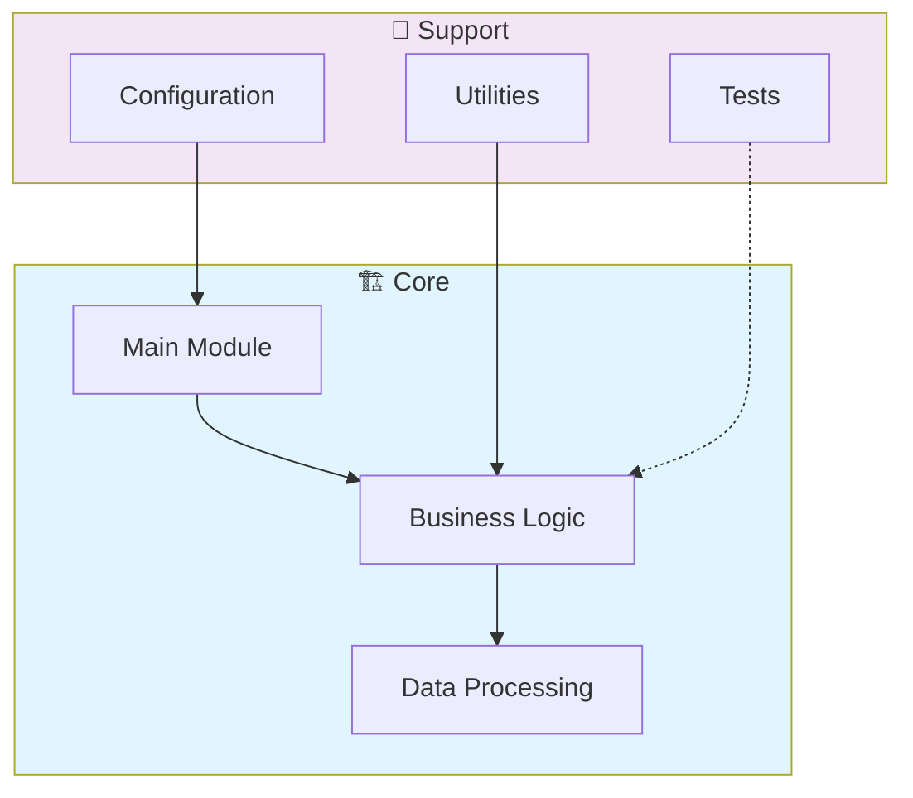

# 📊 Data Quality Framework Great Expectations

> Data quality validation framework built on Great Expectations. Automates data profiling, expectation suites, checkpoint validation, and quality reporting for data pipelines.

[](https://img.shields.io/badge/)
[](https://img.shields.io/badge/)
[](https://img.shields.io/badge/)
[](LICENSE)

[English](#english) | [Português](#português)

---

## English

### 🎯 Overview

**Data Quality Framework Great Expectations** is a production-grade HTML application complemented by CSS, JavaScript, Python that showcases modern software engineering practices including clean architecture, comprehensive testing, containerized deployment, and CI/CD readiness.

The codebase comprises **2,890 lines** of source code organized across **14 modules**, following industry best practices for maintainability, scalability, and code quality.

### ✨ Key Features

- **🔄 Data Pipeline**: Scalable ETL with parallel processing
- **✅ Data Validation**: Schema validation and quality checks
- **📊 Monitoring**: Pipeline health metrics and alerting
- **🔧 Configurability**: YAML/JSON-based pipeline configuration

### 🏗️ Architecture


```mermaid
graph TB
    subgraph Core["🏗️ Core"]
        A[Main Module]
        B[Business Logic]
        C[Data Processing]
    end
    
    subgraph Support["🔧 Support"]
        D[Configuration]
        E[Utilities]
        F[Tests]
    end
    
    A --> B --> C
    D --> A
    E --> B
    F -.-> B
    
    style Core fill:#e1f5fe
    style Support fill:#f3e5f5
```

### 🚀 Quick Start

#### Prerequisites

#### Installation

```bash
git clone https://github.com/galafis/data-quality-framework-great-expectations.git
cd data-quality-framework-great-expectations
```

### 🧪 Testing

Run the test suite to verify everything works correctly.

### 📁 Project Structure

```
data-quality-framework-great-expectations/
├── data/
├── great_expectations/
│   └── expectations/
│       └── sales_data_suite.json
├── images/
├── notebooks/
│   ├── example_great_expectations.py
│   ├── example_profiling.py
│   └── validate_data.py
├── tests/         # Test suite
│   ├── __init__.py
│   ├── test_expectations.py
│   └── test_validate_data.py
├── CODE_OF_CONDUCT.md
├── CONTRIBUTING.md
├── LICENSE
├── README.md
└── requirements.txt
```

### 🛠️ Tech Stack

| Technology | Description | Role |
|------------|-------------|------|
| **HTML** | Core Language | Primary |
| **Great Expectations** | Data validation framework | Framework |
| **Pandas** | Data manipulation library | Framework |
| Python | 6 files | Supporting |
| JavaScript | 1 files | Supporting |
| CSS | 1 files | Supporting |

### 🤝 Contributing

Contributions are welcome! Please feel free to submit a Pull Request. For major changes, please open an issue first to discuss what you would like to change.

1. Fork the project
2. Create your feature branch (`git checkout -b feature/AmazingFeature`)
3. Commit your changes (`git commit -m 'Add some AmazingFeature'`)
4. Push to the branch (`git push origin feature/AmazingFeature`)
5. Open a Pull Request

### 📄 License

This project is licensed under the MIT License - see the [LICENSE](LICENSE) file for details.

### 👤 Author

**Gabriel Demetrios Lafis**
- GitHub: [@galafis](https://github.com/galafis)
- LinkedIn: [Gabriel Demetrios Lafis](https://linkedin.com/in/gabriel-demetrios-lafis)

---

## Português

### 🎯 Visão Geral

**Data Quality Framework Great Expectations** é uma aplicação HTML de nível profissional, complementada por CSS, JavaScript, Python que demonstra práticas modernas de engenharia de software, incluindo arquitetura limpa, testes abrangentes, implantação containerizada e prontidão para CI/CD.

A base de código compreende **2,890 linhas** de código-fonte organizadas em **14 módulos**, seguindo as melhores práticas do setor para manutenibilidade, escalabilidade e qualidade de código.

### ✨ Funcionalidades Principais

- **🔄 Data Pipeline**: Scalable ETL with parallel processing
- **✅ Data Validation**: Schema validation and quality checks
- **📊 Monitoring**: Pipeline health metrics and alerting
- **🔧 Configurability**: YAML/JSON-based pipeline configuration

### 🏗️ Arquitetura


```mermaid
graph TB
    subgraph Core["🏗️ Core"]
        A[Main Module]
        B[Business Logic]
        C[Data Processing]
    end
    
    subgraph Support["🔧 Support"]
        D[Configuration]
        E[Utilities]
        F[Tests]
    end
    
    A --> B --> C
    D --> A
    E --> B
    F -.-> B
    
    style Core fill:#e1f5fe
    style Support fill:#f3e5f5
```

### 🚀 Início Rápido

#### Prerequisites

#### Installation

```bash
git clone https://github.com/galafis/data-quality-framework-great-expectations.git
cd data-quality-framework-great-expectations
```

### 🧪 Testing

Run the test suite to verify everything works correctly.

### 📁 Estrutura do Projeto

```
data-quality-framework-great-expectations/
├── data/
├── great_expectations/
│   └── expectations/
│       └── sales_data_suite.json
├── images/
├── notebooks/
│   ├── example_great_expectations.py
│   ├── example_profiling.py
│   └── validate_data.py
├── tests/         # Test suite
│   ├── __init__.py
│   ├── test_expectations.py
│   └── test_validate_data.py
├── CODE_OF_CONDUCT.md
├── CONTRIBUTING.md
├── LICENSE
├── README.md
└── requirements.txt
```

### 🛠️ Stack Tecnológica

| Tecnologia | Descrição | Papel |
|------------|-----------|-------|
| **HTML** | Core Language | Primary |
| **Great Expectations** | Data validation framework | Framework |
| **Pandas** | Data manipulation library | Framework |
| Python | 6 files | Supporting |
| JavaScript | 1 files | Supporting |
| CSS | 1 files | Supporting |

### 🤝 Contribuindo

Contribuições são bem-vindas! Sinta-se à vontade para enviar um Pull Request.

### 📄 Licença

Este projeto está licenciado sob a Licença MIT - veja o arquivo [LICENSE](LICENSE) para detalhes.

### 👤 Autor

**Gabriel Demetrios Lafis**
- GitHub: [@galafis](https://github.com/galafis)
- LinkedIn: [Gabriel Demetrios Lafis](https://linkedin.com/in/gabriel-demetrios-lafis)
